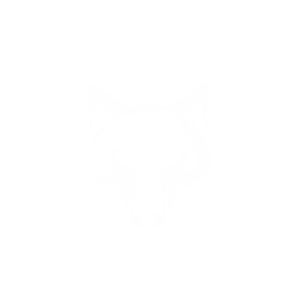

<em>🌌Portafolio personal - Front- end </em>

   
  
  
  
   

   ## 🎯 Objetivo

- Practicar diseño, desarrollo y habilidades propias del Front para alinear y distribuir elementos.
- Crear un layout atractivo.
- Mostrar proyectos personales o en los que estuve involucrado.

## 📸 Vista previa

   <a href="https://brandev103.github.io/Portfolio-BGL/" target="_blank">CHECK IT OUT!</a>
